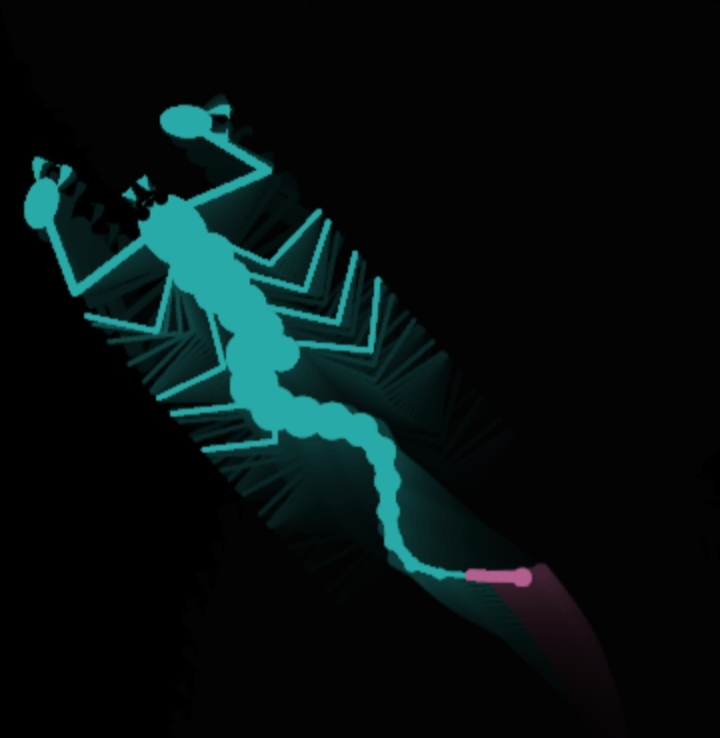
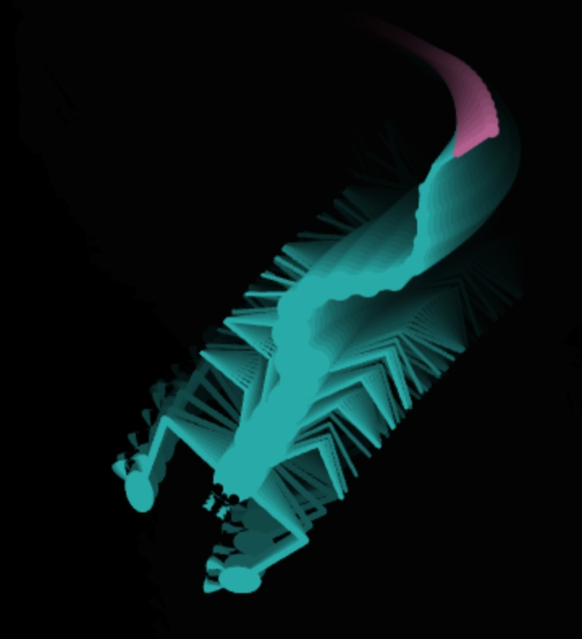

## 🦂 SCORPIO: The Anatomical Legend

Welcome to **Scorpio**, the web project that brings the sleek, dangerous, and oddly hypnotic movements of a desert predator right to your browser. Whether you're here for the aesthetics, the anatomy, or just to watch something crawl across your screen while you procrastinate, you’ve found the right place. 

It’s clean, it’s fixed, and it’s ready to sting (metaphorically). 

---

## 🤩 Why Scorpio?

Because why have a boring static webpage when you can have a high-performance, anatomically inspired arachnid? This project is all about smooth animations, interactive design, and proving that bugs (the eight-legged kind) are actually a feature, not a glitch.

## Demo and Screenshot:


<br/><br/>



---


### ✨ Features
* **Anatomical Precision:** Designed with a focus on structure and movement. 
* **Butter-Smooth Performance:** Optimized code to ensure the legs move faster than your morning coffee kicks in.
* **Clean & Fixed:** No messy joints or broken carapaces here. Just pure, unadulterated CSS/JS magic.
* **Pure Entertainment:** It’s oddly satisfying. Don't say we didn't warn you.

---

## 🛠️ Built With

* **HTML5:** The exoskeleton.
* **CSS3:** The sleek, polished finish.
* **JavaScript:** The nervous system that brings the beast to life.

---

## 🚀 Getting Started

Want to host your own scorpion? It’s easier than catching one in real life.

1.  **Clone the sting:**
    ```bash
    git clone [https://github.com/ghsjulian/scorpio.git](https://github.com/ghsjulian/scorpio.git)
    ```
2.  **Enter the nest:**
    ```bash
    cd scorpio
    ```
3.  **Release the beast:**
    Open `index.html` in any modern browser.

---

## 🎮 How to Play

1.  Open the [Live Demo](https://ghsjulian.github.io/scorpio/).
2.  Watch it move. 
3.  Try not to get intimidated by its superior limb coordination.
4.  Share it with a friend who is scared of spiders (Scorpions are technically different, so it's *fine*).

---

## 🤝 Contributing

Found a way to make it even more legendary? Want to add more pincers? 
1. Fork the repo.
2. Create your feature branch (`git checkout -b feature/AmazingStinger`).
3. Commit your changes (`git commit -m 'Add some venom'`).
4. Push to the branch (`git push origin feature/AmazingStinger`).
5. Open a Pull Request.

---

## 📜 License

This project is open-source and free to use for your own entertainment. Just don't let it crawl into any restricted production databases!

---

**Warning:** *No scorpions were harmed in the making of this code. Your productivity, however, might be at risk.* 😄🦂